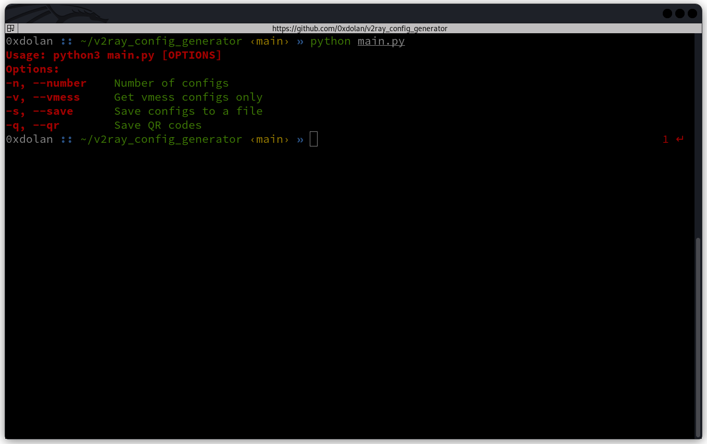
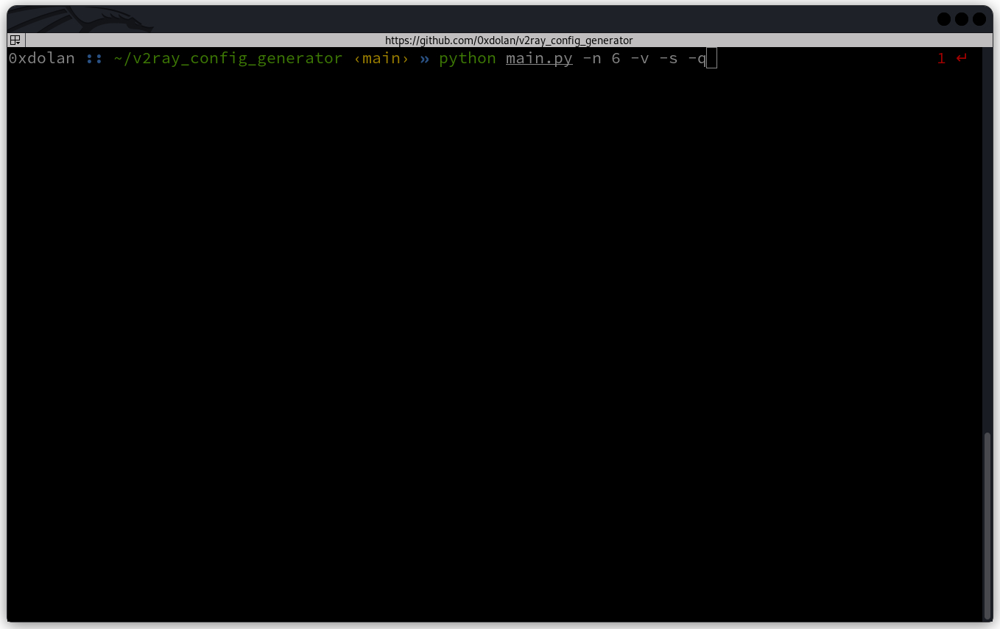

# Download Free V2Ray configs

This small Python script downloads free **V2Ray** configs, which are updated everyday and include *vmess*, *Vless*, *Trojan*, and *ss*.

**Sources:**
``` python
URLS = [
    "https://raw.githubusercontent.com/mahdibland/ShadowsocksAggregator/master/sub/sub_merge.txt",
    "https://raw.githubusercontent.com/awesome-vpn/awesome-vpn/master/all",
    "https://raw.githubusercontent.com/freefq/free/master/v2",
    "https://raw.githubusercontent.com/Pawdroid/Free-servers/main/sub",
    "https://raw.githubusercontent.com/aiboboxx/v2rayfree/main/v2",
    "https://raw.githubusercontent.com/AzadNetCH/Clash/main/V2Ray.txt",
    "https://raw.githubusercontent.com/vpei/Free-Node-Merge/main/o/node.txt",
    "https://raw.githubusercontent.com/tbbatbb/Proxy/master/dist/v2ray.config.txt",
    "https://raw.fastgit.org/ripaojiedian/freenode/main/sub",
    "https://github.xiaoku666.tk/https://raw.githubusercontent.com/ripaojiedian/freenode/main/sub",
    "https://raw.githubusercontent.com/learnhard-cn/free_proxy_ss/main/v2ray/v2raysub",
]
```

### How to use






